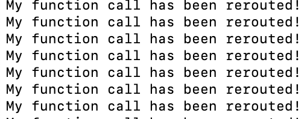

# Toy App: Function Caller

This program simply loops every few seconds and calls do_nothing() each iteration.

## Usage

Navigate to this directory and execute `cargo run` - this should (if you have Rust installed) start this application.

Open a new terminal window, navigate to `osx_terminal_ex/apps/reroute_function_call` and run `mix deps.get` and `mix run`

Tested on an M1 Mac with SIP disabled. View root README.md if you have any questions!

## Examples

- `osx_terminal_ex/apps/reroute_function_call` will modify the program to call `print_message()` instead of `do_nothing()`, while it is running.

