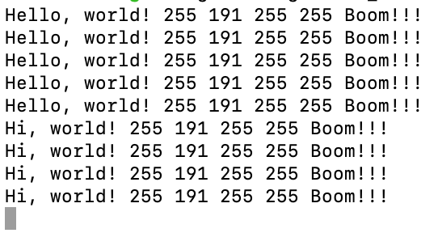

# Toy App: Hello World

This program simply outputs some static text, every several seconds.

## Usage

Navigate to this directory and execute `cargo run` - this should (if you have Rust installed) start this application.

Open a new terminal window, navigate to `osx_terminal_ex/apps/hello_world_tweak` and run `mix deps.get` and `mix run`

Tested on an M1 Mac with SIP disabled. View root README.md if you have any questions!

## Examples

- `osx_terminal_ex/apps/hello_world_tweak` will modify the text that this program prints, while it is running.

